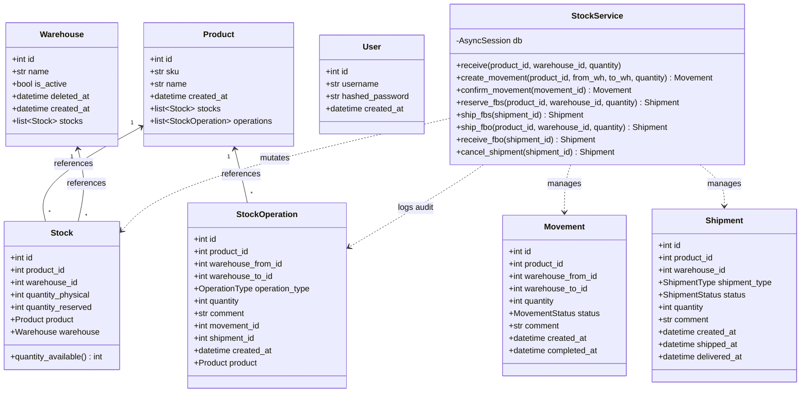

# UML Диаграмма архитектуры системы CheckStock

Данная диаграмма отражает текущую структуру классов, моделей данных, сервисов и взаимосвязей проекта CheckStock.

```mermaid
classDiagram
    direction TB

    class Product {
        +int id
        +str sku
        +str name
        +datetime created_at
        +list~Stock~ stocks
        +list~StockOperation~ operations
    }

    class Warehouse {
        +int id
        +str name
        +bool is_active
        +datetime deleted_at
        +datetime created_at
        +list~Stock~ stocks
    }

    class Stock {
        +int id
        +int product_id
        +int warehouse_id
        +int quantity_physical
        +int quantity_reserved
        +Product product
        +Warehouse warehouse
        +quantity_available() int
    }

    class StockOperation {
        +int id
        +int product_id
        +int warehouse_from_id
        +int warehouse_to_id
        +OperationType operation_type
        +int quantity
        +str comment
        +int movement_id
        +int shipment_id
        +datetime created_at
        +Product product
    }

    class Movement {
        +int id
        +int product_id
        +int warehouse_from_id
        +int warehouse_to_id
        +int quantity
        +MovementStatus status
        +str comment
        +datetime created_at
        +datetime completed_at
    }

    class Shipment {
        +int id
        +int product_id
        +int warehouse_id
        +ShipmentType shipment_type
        +ShipmentStatus status
        +int quantity
        +str comment
        +datetime created_at
        +datetime shipped_at
        +datetime delivered_at
    }

    class User {
        +int id
        +str username
        +str hashed_password
        +datetime created_at
    }

    class StockService {
        -AsyncSession db
        +receive(product_id, warehouse_id, quantity)
        +create_movement(product_id, from_wh, to_wh, quantity) Movement
        +confirm_movement(movement_id) Movement
        +reserve_fbs(product_id, warehouse_id, quantity) Shipment
        +ship_fbs(shipment_id) Shipment
        +ship_fbo(product_id, warehouse_id, quantity) Shipment
        +receive_fbo(shipment_id) Shipment
        +cancel_shipment(shipment_id) Shipment
    }

    Product "1" <-- "*" Stock : references
    Warehouse "1" <-- "*" Stock : references
    Product "1" <-- "*" StockOperation : references
    StockService ..> Stock : mutates
    StockService ..> Movement : manages
    StockService ..> Shipment : manages
    StockService ..> StockOperation : logs audit
```
